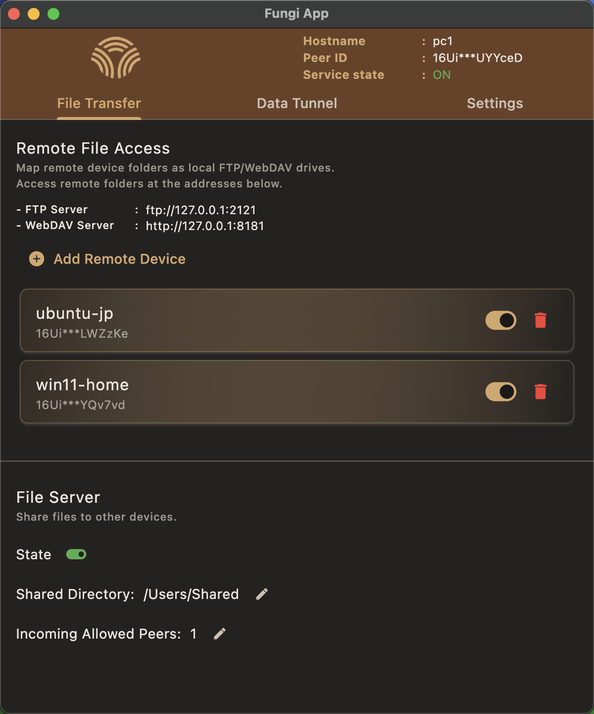
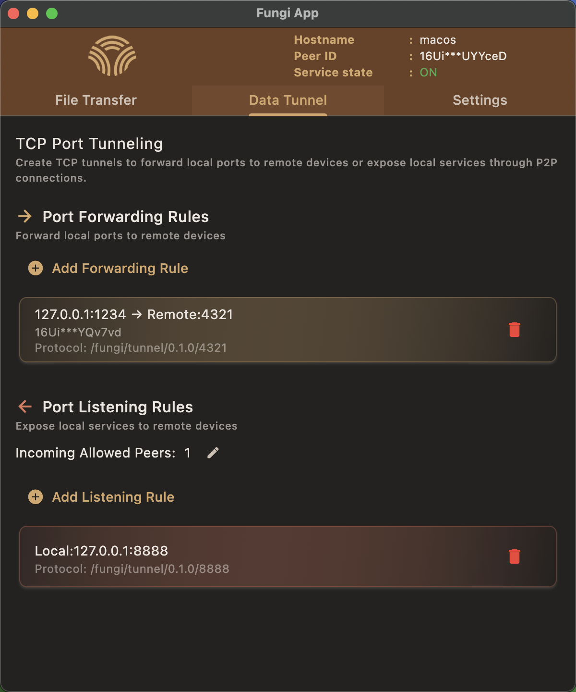

<h1 align="center">
  <br>
  <a href="https://github.com/enbop/fungi"></a>
  <br>
  <br>
  Fungi
  <br>
</h1>

<p align="center" style="font-size: 1.2rem;">Turn Multiple Devices Into One Unified System</p>
<p align="center" style="font-size: 1rem;">A platform built for seamless multi-device integration</p>
<p align="center" style="font-size: 0.9rem; color: #666;">File Transfer • Port Forwarding • Cross-Device Integration (Coming Soon)</p>

<p align="center">
  <a href="docs/README_zh.md">🇨🇳 简体中文</a> •
  <a href="docs/README_ja.md">🇯🇵 日本語</a>
</p>

<div align="center">
  
  
</div>

<hr/>

## What is Fungi?

Fungi lets you securely connect and manage multiple devices through P2P connections. No server can see your data - everything is encrypted end-to-end between your devices.

Built with Rust (using [rust-libp2p](https://github.com/libp2p/rust-libp2p) for p2p) and Flutter for cross-platform UI.

### What You Can Do

📁 **File Transfer**
- Mount remote folders as local drives (FTP/WebDAV)

🔗 **Port Forwarding** 

🔮 **Cross-Device Integration** *(Coming Soon)*

## How It Works

**Local Network**: Devices automatically discover each other via mDNS - no setup needed.

**Internet**: Attempts NAT hole punching for direct P2P connections. If successful, data flows directly between devices; otherwise uses relay server. All traffic is end-to-end encrypted - relay server only sees encrypted data packets. By default, we provide a relay server.

## Download
[Get the latest release](https://github.com/enbop/fungi/releases):

Available in two versions:
- **fungi-cli**: Command-line interface for terminal users
- **fungi-app**: Graphical user interface with Flutter UI

## Quick Start (fungi-app)

**Prerequisites**: 
1. Launch `Fungi App` on both devices
2. Click on each device's `PeerID` at the top of the app to automatically copy it and save them
   - **Tip**: You can also use "Select from Local Devices (mDNS)" to quickly choose devices that are currently online in the same local network

> File Transfer and Port Forwarding are independent features. You can use either one without the other based on your needs.

---

### 📁 File Transfer Example: Device A accessing files on Device B

**Use Case**: Access files from one device on another device through FTP/WebDAV.

**On Device B (File Server):**
1. Navigate to **File Transfer > File Server > Incoming Allowed Peers**
2. Add Device A's `PeerID` to the allowed list
3. Set **Shared Directory** to the folder you want to share (e.g., `/tmp`)
4. Enable **File Server State**

**On Device A (File Client):**
1. Go to **File Transfer > Remote File Access > Add Remote Device**
2. Add Device B's PeerID and assign an alias

**Access Files:**
The FTP/WebDAV addresses are displayed on home page. 
Use any FTP or WebDAV client on Device A to access the directory of Device B.
*(Both macOS and Windows built-in file managers can mount WebDAV as a drive)*

---

### 🔗 Port Forwarding Example: Accessing Device B's service from Device A

**Use Case**: Access services running on one device from another device through port tunneling.

**On Device B (Port Listening):**
1. Navigate to **Data Tunnel > Port Listening Rules**
2. Add the port you want to forward (e.g., `8080`)

**On Device A (Port Forwarding):**
1. Navigate to **Data Tunnel > Port Forwarding Rules**
2. Add Device B's PeerID and set up port mapping (e.g., local `9090` → remote `8080`)

**Access Service:**
Connect `localhost:9090` on Device A to reach the service running on Device B's port `8080`.

---

### Quick Start (fungi-cli)

See the [CLI Service Quick Start Guide](docs/cli_service_quick_start.md).

## Build from Source

All platforms require Rust and Flutter to be installed.

### Build fungi-cli

Simply run:
```bash
cargo build --release --bin fungi
```
The binary will be located at:
```
./target/release/fungi
```

### Build fungi-app

#### Ubuntu
```
sudo apt-get install -y clang cmake ninja-build pkg-config libgtk-3-dev libayatana-appindicator3-dev

cd flutter_app
flutter build linux --release
```

#### macOS
```bash
cd flutter_app
flutter build macos --release
```

#### Windows

Install aws-lc-rs [build dependencies](https://aws.github.io/aws-lc-rs/requirements/windows.html)

Ensure you have at least: C/C++ Compiler, CMake, NASM

```bash
cargo build --release -p rust_lib_fungi_app
flutter build windows --release
```

## Platform Support

| Platform | Status |
|----------|--------|
| macOS    | ✅ Ready |
| Windows  | ✅ Ready |
| Linux    | ✅ Ready |
| Android  | ✅ Ready |
| iOS      | 🚧 In progress |

## Contributing

We welcome all contributions:
- 🐛 Bug reports and fixes
- ✨ New features
- 📖 Documentation
- 🎨 UI improvements

## License

Apache License 2.0 - see [LICENSE](LICENSE) for details.
