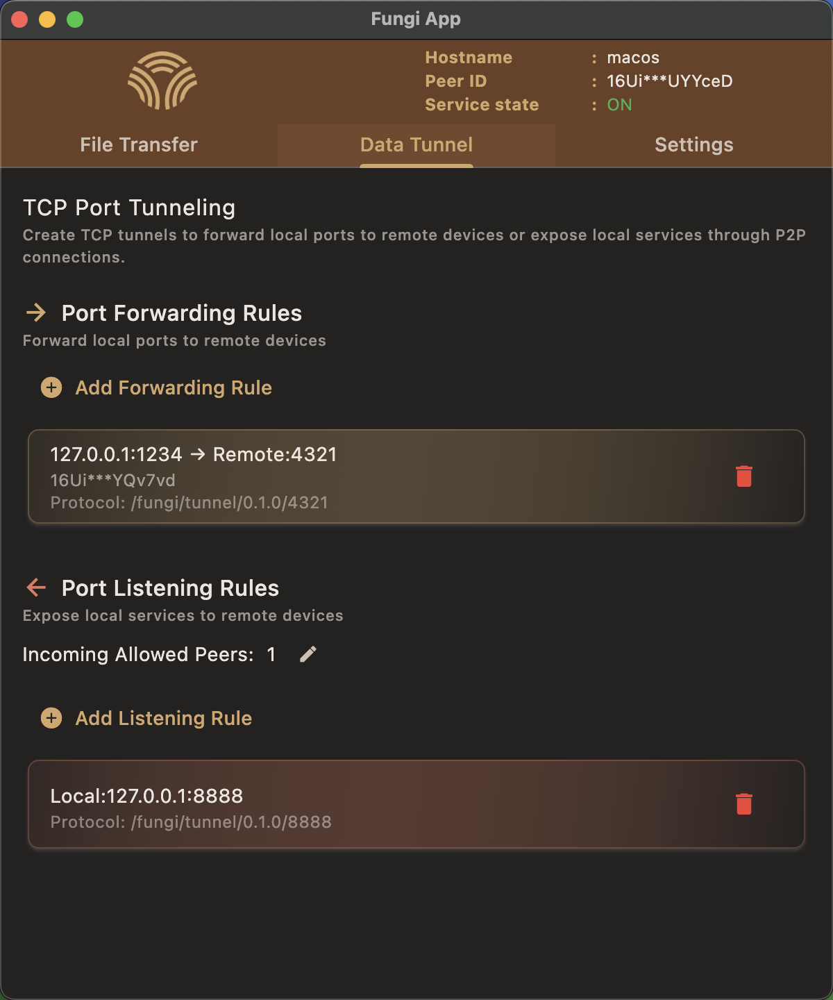

<h1 align="center">
  <br>
  <a href="https://github.com/enbop/fungi"></a>
  <br>
  <br>
  Fungi
  <br>
</h1>

<p align="center" style="font-size: 1.2rem;">将多设备融合为统一系统</p>
<p align="center" style="font-size: 1rem;">打造无缝多设备集成的平台</p>
<p align="center" style="font-size: 0.9rem; color: #666;">文件传输 • 端口转发 • 跨设备集成（即将推出）</p>

<p align="center">
  <a href="../README.md">English</a> •
  <a href="README_ja.md">日本語</a>
</p>

<div align="center">
  
  
</div>

<hr/>

## 什么是 Fungi？

Fungi 让您通过 P2P 连接安全地连接和管理多个设备。没有服务器能看到您的数据 - 所有内容都在您的设备之间进行端到端加密。

基于 Rust 构建（采用 [rust-libp2p](https://github.com/libp2p/rust-libp2p) 实现 P2P 通信）并配以 Flutter 跨平台用户界面。

## 为什么选择 Fungi？

🚀 **零配置 P2P** - 设备间直接连接，自动 NAT 穿透，无需公网 IP

🛡️ **安全优先** - 端到端加密，基于 PeerID 的身份验证和白名单访问控制

🏗️ **模块化架构** - Daemon 与控制层解耦，通过 gRPC 协议通信。可使用 Fungi App、Fungi CLI 或任何 gRPC 客户端与 daemon 交互

🌐 **网关架构** - 将任何设备转变为网络中服务和文件的网关

⚡ **随处可用** - 通过 mDNS 自动发现本地网络设备，互联网连接时无缝回退到中继服务器

🔧 **自建友好** - 使用我们的免费中继服务器或部署您自己的服务器

📦 **轻量 NAS** - 将任何设备转换为带有 WebDAV/FTP 挂载的个人云存储

🎯 **真正跨平台** - 支持桌面（Windows/macOS/Linux）、移动（Android）、ARM 设备（树莓派、香橙派等）

### 您可以做什么

📁 **文件传输**
- 将远程文件夹挂载为本地驱动器（支持 FTP/WebDAV）
- 像轻量 NAS 一样从任何设备访问文件

🔗 **端口转发** 
- 转发 SSH、RDP 和任何 TCP 服务，无需 VPS
- 设备间的安全隧道

🔮 **跨设备集成** *（即将推出）*
- 远程计算和命令执行
- WASI 沙箱，支持跨平台应用部署

## 工作原理

**本地网络**：设备通过 mDNS 自动发现彼此 - 无需设置。

**互联网连接**：尝试 NAT 打洞进行直接 P2P 连接。如果成功，数据直接在设备间流动；否则使用中继服务器。所有流量都是端到端加密的 - 中继服务器只能看到加密的数据包。默认情况下，我们提供了一个中继服务器。

## 下载
[获取最新版本](https://github.com/enbop/fungi/releases)：

提供两个版本：
- **fungi-cli**：面向终端用户的命令行界面
- **fungi-app**：带有 Flutter 用户界面的图形化界面

## 快速开始（fungi-app）

**前提条件**：
1. 在两个设备上都启动 `Fungi App`
2. 点击应用顶部的 `PeerID` 自动复制并保存它们
   - **提示**：您也可以使用 "Select from Local Devices (mDNS)" 功能快速选择同一局域网中当前在线的设备

> 文件传输和端口转发是独立的功能。您可以根据需要单独使用其中任何一个。

---

### 📁 文件传输示例：设备 A 访问设备 B 上的文件

**使用场景**：通过 FTP/WebDAV 从一个设备访问另一个设备上的文件。

**在设备 B（文件服务器）上：**
1. 导航到 **File Transfer > File Server > Incoming Allowed Peers**
2. 将设备 A 的 `PeerID` 添加到允许列表中
3. 设置 **Shared Directory** 为要共享的文件夹（例如 `/tmp`）
4. 启用 **File Server State**

**在设备 A（文件客户端）上：**
1. 转到 **File Transfer > Remote File Access > Add Remote Device**
2. 添加设备 B 的 PeerID 并分配别名

**访问文件：**
FTP/WebDAV 地址会显示在主页上。
使用设备 A 上的任何 FTP 或 WebDAV 客户端来访问设备 B 的目录。
*（macOS 和 Windows 内置文件管理器都可以将 WebDAV 挂载为驱动器）*

---

### 🔗 端口转发示例：从设备 A 访问设备 B 的服务

**使用场景**：通过端口隧道从一个设备访问另一个设备上运行的服务。

**在设备 B（端口监听）上：**
1. 导航到 **Data Tunnel > Port Listening Rules**
2. 添加要转发的端口（例如 `8080`）

**在设备 A（端口转发）上：**
1. 导航到 **Data Tunnel > Port Forwarding Rules**
2. 添加设备 B 的 PeerID 并设置端口映射（例如本地 `9090` → 远程 `8080`）

**访问服务：**
在设备 A 上连接 `localhost:9090` 来访问设备 B 端口 `8080` 上运行的服务。

---

### 快速开始（fungi-cli）

参见 [CLI 服务快速开始指南](cli_service_quick_start.md)。

## 从源码构建

### 前置要求

**所有平台都需要：**
- Rust 工具链
- Flutter SDK（仅 fungi-app 需要）
- Protocol Buffers 编译器（protoc）

#### 安装依赖

**Ubuntu/Debian：**
```bash
sudo apt-get install -y protobuf-compiler clang cmake ninja-build pkg-config libgtk-3-dev libayatana-appindicator3-dev
```

**macOS：**
```bash
brew install protobuf
```

**Windows：**

- 安装 aws-lc-rs [构建依赖](https://aws.github.io/aws-lc-rs/requirements/windows.html)（确保您至少安装了：C/C++ 编译器、CMake、NASM）

- 安装 protoc：
```powershell
choco install protoc
```

### 构建 fungi-cli

```bash
cargo build --release --bin fungi
```

二进制文件位置：`./target/release/fungi`

### 构建 fungi-app
```bash
cd flutter_app
```

**Linux：**
```bash
flutter build linux --release
```

**macOS：**
```bash
flutter build macos --release
```

**Windows：**
```bash
flutter build windows --release
```

## 平台支持

| 平台 | 状态 |
|----------|--------|
| macOS    | ✅ 就绪 |
| Windows  | ✅ 就绪 |
| Linux    | ✅ 就绪 |
| Android  | ✅ 就绪 |
| iOS      | 🚧 开发中 |

## 贡献

我们欢迎所有贡献：
- 🐛 错误报告和修复
- ✨ 新功能
- 📖 文档
- 🎨 界面改进

## 许可证

Apache License 2.0
